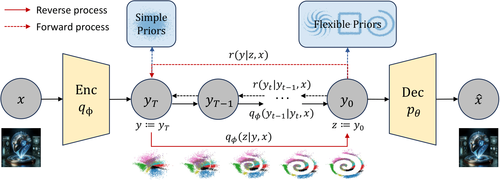
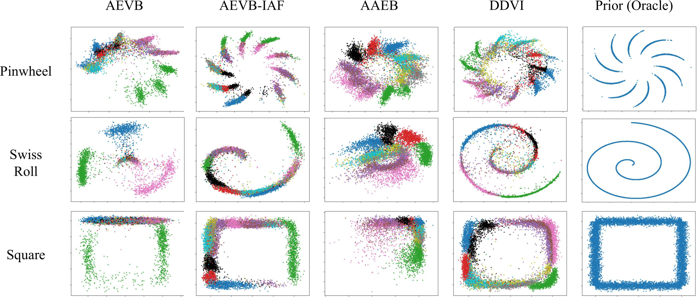

# [Denoising Diffusion Variational Inference (DDVI): Diffusion Models as Expressive Variational Posteriors](https://arxiv.org/abs/2401.02739)

By [Wasu Top Piriyakulkij*](https://www.cs.cornell.edu/~wp237/), [Yingheng Wang*](https://isjakewong.github.io/), [Volodymyr Kuleshov](https://www.cs.cornell.edu/~kuleshov/) (* denotes equal contribution)

[](https://arxiv.org/abs/2401.02739)

Accepted to [AAAI 2025](https://aaai.org/conference/aaai/aaai-25/)




We propose denoising diffusion variational inference (DDVI), a black-box variational inference algorithm for latent variable models which relies on diffusion models as flexible approximate posteriors. Specifically, our method introduces an expressive class of diffusion-based variational posteriors that perform iterative refinement in latent space; we train these posteriors with a novel regularized evidence lower bound (ELBO) on the marginal likelihood inspired by the wake-sleep algorithm. Our method is easy to implement (it fits a regularized extension of the ELBO), is compatible with black-box variational inference, and outperforms alternative classes of approximate posteriors based on normalizing flows or adversarial networks. We find that DDVI improves inference and learning in deep latent variable models across common benchmarks as well as on a motivating task in biology -- inferring latent ancestry from human genomes -- where it outperforms strong baselines on the Thousand Genomes dataset.

# Installation
```
conda create -n ddvi python=3.7
conda activate ddvi
pip install -r requirements.txt
```

# Running DDVI

You can run the experiments by calling `run.sh` which takes three arguments: dataset, learning algorithm, and prior respectively

Unsupervised learning on MNIST with DDVI
```
./run.sh mnist diff_vae_warmup pinwheel
./run.sh mnist diff_vae_warmup swiss_roll
./run.sh mnist diff_vae_warmup less_noisy_square
```

Unsupervised learning on CIFAR with DDVI
```
./run.sh cifar diff_vae_warmup pinwheel
./run.sh cifar diff_vae_warmup swiss_roll
./run.sh cifar diff_vae_warmup less_noisy_square
```

Semi-supervised learning on MNIST with DDVI
```
./run.sh mnist_semi diff_vae_warmup_semi pinwheel
./run.sh mnist_semi diff_vae_warmup_semi swiss_roll
./run.sh mnist_semi diff_vae_warmup_semi less_noisy_square
```

Semi-supervised learning on CIFAR with DDVI
```
./run.sh cifar_semi diff_vae_warmup_semi pinwheel
./run.sh cifar_semi diff_vae_warmup_semi swiss_roll
./run.sh cifar_semi diff_vae_warmup_semi less_noisy_square
```

# Running baselines

Available unsupervised learning baselines are [vae, iaf_vae, h_iaf_vae, aae]

Unsupervised learning on MNIST with baselines
```
for method in vae iaf_vae h_iaf_vae aae; do
    ./run.sh mnist $method pinwheel
    ./run.sh mnist $method swiss_roll
    ./run.sh mnist $method less_noisy_square
done
```

Unsupervised learning on CIFAR with baselines
```
for method in vae iaf_vae h_iaf_vae aae; do
    ./run.sh cifar $method pinwheel
    ./run.sh cifar $method swiss_roll
    ./run.sh cifar $method less_noisy_square
done
```

Available unsupervised learning baselines are [vae_semi, iaf_vae_semi, aae_semi]

Semi-supervised learning on MNIST with baselines
```
for method in vae_semi iaf_vae_semi aae_semi; do
    ./run.sh mnist_semi $method pinwheel
    ./run.sh mnist_semi $method swiss_roll
    ./run.sh mnist_semi $method less_noisy_square
done
```

Semi-supervised learning on CIFAR with baselines
```
for method in vae_semi iaf_vae_semi aae_semi; do
    ./run.sh cifar_semi $method pinwheel
    ./run.sh cifar_semi $method swiss_roll
    ./run.sh cifar_semi $method less_noisy_square
done
```

# Citation
```
@inproceedings{piriyakulkij-wang:aaai25,
  Author = {Piriyakulkij, Wasu Top and Wang, Yingheng and Kuleshov, Volodymyr},
  Booktitle = {Proceedings of the AAAI Conference on Artificial Intelligence},
  Title = {Denoising Diffusion Variational Inference: Diffusion Models as Expressive Variational Posteriors},
  Year = {2025}}
```